# Smart IoT Edge Gateway Platform

A simulated IoT sensor network with an MQTT-based **edge gateway** that performs local analytics
(rolling aggregation + anomaly detection) before forwarding condensed data to a cloud dashboard.

This project models a real-world pattern used in telecom/IoT infrastructure: pushing
compute to the edge to reduce bandwidth, latency, and cloud cost — directly relevant to
edge computing, 5G/IoT connectivity, and network operations work.

---

## Architecture

```mermaid
%%{init: {'theme': 'dark', 'themeVariables': { 'primaryColor': '#1e3a5f', 'primaryTextColor': '#e0e6ed', 'primaryBorderColor': '#3b82f6', 'lineColor': '#64748b', 'secondaryColor': '#0f172a', 'tertiaryColor': '#1e293b', 'fontFamily': 'Inter, system-ui, sans-serif'}}}%%

flowchart TB
    subgraph Edge["🔷 EDGE TIER — Local Network"]
        direction TB
        
        subgraph Sensors["Sensor Nodes (Simulated)"]
            S1["🌡️ Temp Sensor<br/>1Hz | MQTT QoS 1"]
            S2["💧 Humidity Sensor<br/>0.5Hz | MQTT QoS 1"]
            S3["🚶 Motion Sensor<br/>2Hz | MQTT QoS 1"]
        end
        
        subgraph Broker["MQTT Broker"]
            MB[("Mosquitto<br/>Port 1883<br/>Session Persistence")]
        end
        
        subgraph Gateway["Edge Gateway — Reliability Anchor"]
            direction TB
            
            subgraph Ingestion["Ingestion Pipeline"]
                MC["MQTT Client<br/>Auto-Reconnect<br/>Backpressure Control"]
                IR["Ingest Router<br/>Schema Validation<br/>Metadata Enrichment"]
            end
            
            subgraph Processing["Processing Engine"]
                RA["Rolling Average<br/>Window = 10 samples"]
                AD["Anomaly Detector<br/>Threshold + Z-Score"]
            end
            
            subgraph Persistence["Durable Buffer"]
                WAL[("SQLite WAL Queue<br/>status: enqueued | inflight | acked | dead")]
            end
            
            subgraph Egress["Egress"]
                HF["HTTP Forwarder<br/>Batch = 100 records<br/>Exponential Backoff"]
            end
        end
    end
    
    subgraph Cloud["🔶 CLOUD TIER — Remote Datacenter"]
        direction TB
        
        subgraph API["REST API Layer"]
            ING["/api/v1/telemetry/batch<br/>Rate Limit: 1000 req/min"]
            QRY["/api/v1/telemetry<br/>Filter: sensor_id, time, anomaly"]
            SSE["/api/v1/live<br/>Server-Sent Events Stream"]
        end
        
        subgraph Service["Service Layer"]
            BL["Business Logic<br/>Deduplication<br/>Aggregation"]
        end
        
        subgraph Storage["Persistent Storage"]
            CS[("SQLite Cloud<br/>telemetry | sensors | anomalies")]
        end
        
        subgraph Dashboard["Live Dashboard"]
            LC["Live Charts<br/>Real-time Updates"]
            AP["Anomaly Panel<br/>Alert Flash"]
        end
    end
    
    subgraph Monitoring["📊 OBSERVABILITY"]
        PROM["Prometheus<br/>Metrics Scrape"]
        GRAF["Grafana<br/>Operational Dashboards"]
        ALERT["Alert Manager<br/>PagerDuty / Slack"]
    end
    
    S1 -->|"MQTT Publish<br/>sensors/temp/01"| MB
    S2 -->|"MQTT Publish<br/>sensors/humidity/01"| MB
    S3 -->|"MQTT Publish<br/>sensors/motion/01"| MB
    
    MB -->|"MQTT Subscribe<br/>sensors/+/+"| MC
    
    MC --> IR
    IR --> RA
    RA --> AD
    AD --> WAL
    WAL -->|"Batch Dispatch"| HF
    
    HF -->|"HTTPS POST<br/>Aggregated + Anomalies"| ING
    
    ING --> BL
    QRY --> BL
    BL --> CS
    CS --> SSE
    SSE -->|"SSE Stream<br/>telemetry | anomaly | heartbeat"| LC
    SSE --> AP
    
    Gateway -.->|"iot_* metrics"| PROM
    Cloud -.->|"api_* metrics"| PROM
    PROM --> GRAF
    PROM --> ALERT
    
    classDef sensor fill:#1e3a5f,stroke:#3b82f6,stroke-width:2px,color:#e0e6ed
    classDef broker fill:#0f172a,stroke:#f59e0b,stroke-width:2px,color:#e0e6ed
    classDef gateway fill:#1e293b,stroke:#10b981,stroke-width:2px,color:#e0e6ed
    classDef cloud fill:#1e293b,stroke:#8b5cf6,stroke-width:2px,color:#e0e6ed
    classDef storage fill:#0f172a,stroke:#ec4899,stroke-width:2px,color:#e0e6ed
    classDef monitor fill:#1e293b,stroke:#f97316,stroke-width:2px,color:#e0e6ed
    classDef api fill:#1e3a5f,stroke:#06b6d4,stroke-width:2px,color:#e0e6ed
    
    class S1,S2,S3 sensor
    class MB broker
    class MC,IR,RA,AD,HF gateway
    class ING,QRY,SSE,BL,LC,AP cloud
    class WAL,CS storage
    class PROM,GRAF,ALERT monitor
    class ING,QRY,SSE api
```



**Why this design?** Raw sensor data is noisy and high-volume. The gateway node (which in a
real deployment would sit physically close to the sensors, e.g. on a base station or local
hub) filters, aggregates, and only escalates *meaningful* events — anomalies and periodic
summaries — to the cloud. This mirrors how edge computing reduces backhaul traffic in real
IoT/telecom networks.

---

## Components

| File | Responsibility |
|---|---|
| `src/sensor_node.py` | Simulates N independent IoT sensor nodes publishing telemetry over MQTT at randomized intervals, with injected noise and occasional anomalies |
| `src/edge_gateway.py` | Subscribes to sensor topics, maintains a rolling window per sensor, computes moving average/std-dev, flags anomalies (z-score based), persists raw+aggregated data locally (SQLite), and forwards summaries to the cloud server via REST |
| `src/cloud_server.py` | Flask REST API that receives aggregated data & anomaly alerts, stores history, and serves a live dashboard |
| `dashboard/templates/index.html` | Live-updating dashboard (Chart.js) showing per-sensor trends and anomaly log |
| `src/config.py` | Central configuration (topics, thresholds, intervals) |
| `tests/test_edge_gateway.py` | Unit tests for the anomaly detection & aggregation logic |

---

## Setup

### 1. Install an MQTT broker (Mosquitto)
```bash
# Ubuntu/Debian
sudo apt-get install mosquitto mosquitto-clients
sudo systemctl start mosquitto

# macOS
brew install mosquitto
brew services start mosquitto
```

### 2. Install Python dependencies
```bash
python -m venv venv
source venv/bin/activate      # Windows: venv\Scripts\activate
pip install -r requirements.txt
```

### 3. Run the system (3 terminals)
```bash
# Terminal 1 - Cloud server + dashboard
python src/cloud_server.py

# Terminal 2 - Edge gateway
python src/edge_gateway.py

# Terminal 3 - Sensor simulators
python src/sensor_node.py
```

### 4. Dashboard


---

## Running Tests
```bash
pytest tests/ -v
```

---

## Project Report
See [`docs/report.md`](docs/report.md) for a full write-up (problem statement, design decisions,
challenges, and results) suitable for a portfolio or university submission.
